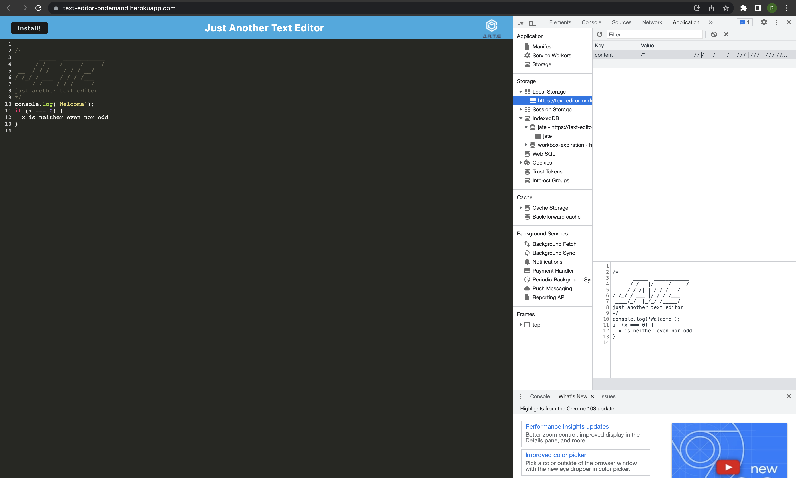
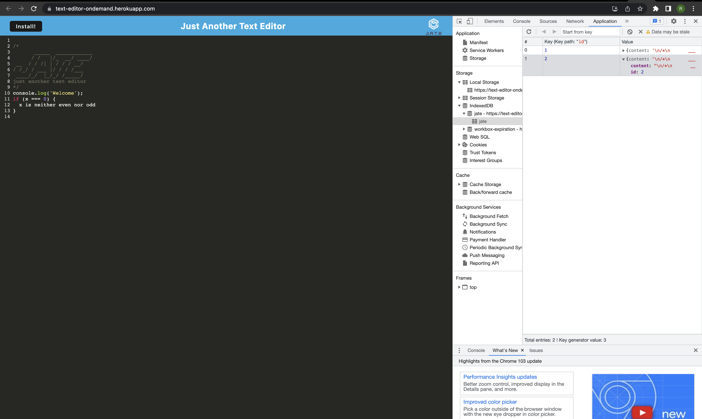
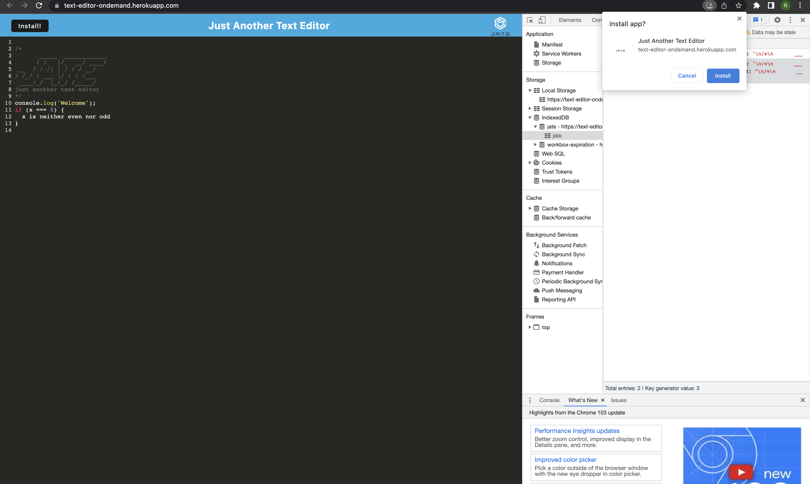
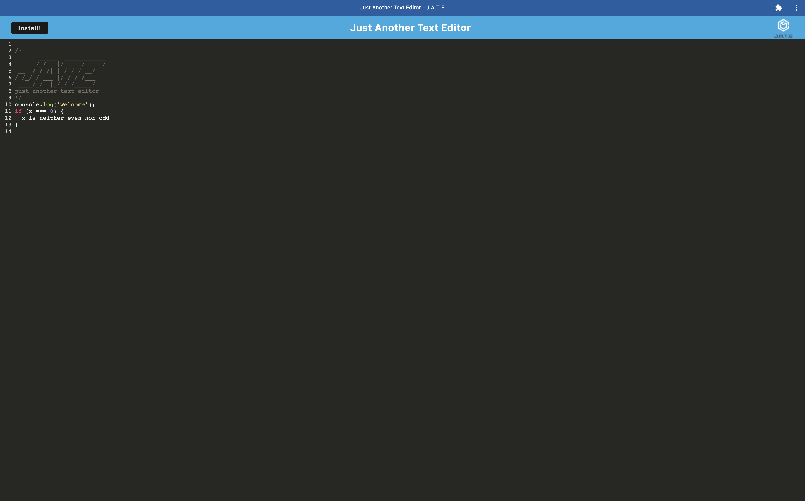

# TEXT EDITOR (as PWA)

This text editor application is PWA (Progressive web application), which blend the benefits of a traditional browser experience with those of a mobile application. This application uses the Service Worker and Cache APIs to cache assets and API responses, which ensures that the application will continue to work without an internet connection. Using webpack and workbox unlocking the power of services workers to cache static CSS, JavaScript, HTML files, images, and even API requests. 

## Technologies Used

- Front End Technologies
    - HTML
    - CSS
    - Vanilla Javascript
    - Service Workers and caching API
    - npm packages
        - webpack
        - babel
- BackEnd Technologies
    - NodeJS 
    - npm packages
        - ExpressJS for routing

## Application Details

This application is deployed and hosted in heroku

GH Repo @ https://github.com/rajeswarivmarimuthu/just-another-text-editor
Hosted @ https://text-editor-ondemand.herokuapp.com/

## Usage
This application is hosted in [here](https://text-editor-ondemand.herokuapp.com/). Contributors are welcome to this repo!!  Fork/clone the application and could be validated in local using npm start, this would build and run the application. 

## Demo

As traditional webapp, 

With Install Prompt,

As PWA, 

